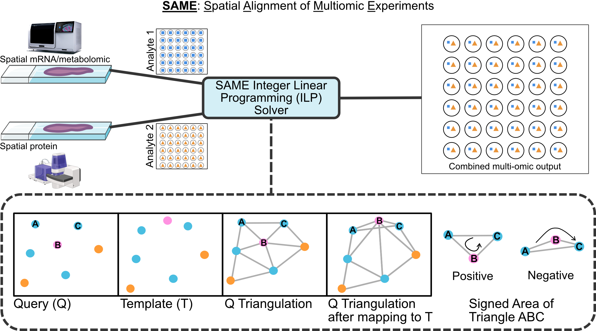

# SAME
Spatial Alignment of Multimodal Expression

**SAME (Spatial Alignment of Multimodal Expression)** is a computational framework for aligning and integrating spatial omics data across serial tissue sections and modalities (e.g., proteins, transcripts, metabolites). SAME introduces space-tearing transforms, enabling controlled, localized topological disruptions during cross-sectional alignment. 

SAME implements the controlled space-tearing transforms using a 0-1 integer linear programming (ILP) model. The ILP model is implemented in the [Gurobi](https://www.gurobi.com/) solver. Please refer to the [Gurobi website](https://www.gurobi.com/) for a free academic license and insert the license key in the `src/.gurobienv` file (see the template in the `src` directory).

## Installation
The src/ directory can be imported directly as a package.  See examples in the `examples` directory. Please install the dependencies manually. A future release will include a setup.py file to install the dependencies automatically.

---

## Citation

If you use SAME in your research, please cite:

Aditya Pratapa, Siavash Mansouri, Nadezhda Nikulina, Bruno Matuck, Marc A. Schneider, Kevin Matthew Byrd, Rajkumar Savai, Purushothama Rao Tata, and Rohit Singh. "SAME: Topology-flexible transforms enable robust integration of multimodal spatial omics." bioRxiv (2025): 2025-07: https://doi.org/10.1101/2025.07.12.664419

---

This repository contains the code and resources for the SAME manuscript.
