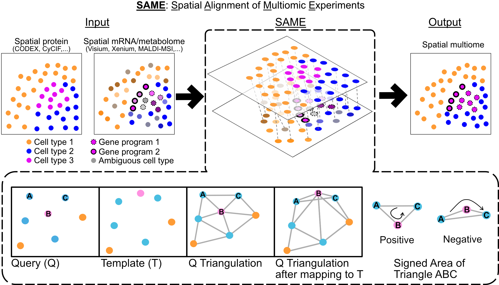

# SAME

**Spatial Alignment of Multimodal Expression**

[](https://opensource.org/licenses/MIT)
[](https://www.python.org/downloads/)
[](https://rohitsinghlab.github.io/SAME/)



**SAME** is a computational framework for aligning and integrating spatial omics data across serial tissue sections and modalities (e.g., proteins, transcripts, metabolites). SAME introduces **space-tearing transforms**, enabling controlled, localized topological disruptions during cross-sectional alignment.

## Key Features

- **Topology-flexible transforms**: Unlike rigid registration, SAME allows controlled space-tearing where spatial relationships can break
- **Mixed Integer Programming**: Optimal cell matching with spatial constraints via Delaunay triangulation
- **Metacell support**: Graph simplification for efficient processing of large datasets (10,000+ cells)
- **Lazy constraints**: Memory-efficient O(n) constraint generation
- **Sliding window**: Process arbitrarily large spatial regions

## Installation

```bash
# Clone repository
git clone https://github.com/rohitsinghlab/SAME.git
cd SAME

# Install with pip
pip install -e .

# Or install with optional dependencies
pip install -e ".[geometry,notebooks]"
```

### Gurobi License

SAME requires [Gurobi](https://www.gurobi.com/) for optimization. Academic users can obtain a [free license](https://www.gurobi.com/academia/academic-program-and-licenses/).

Create `src/.gurobienv` with your credentials:
```
WLSACCESSID=your_access_id
WLSSECRET=your_secret
LICENSEID=your_license_id
```

## Quick Start

```python
from src import run_same, init_optim_params

# Run SAME optimization
matches, var_out = run_same(
    ref_df=reference_data,
    aligned_df=moving_data,
    commonCT=['CellTypeA', 'CellTypeB', 'CellTypeC'],
    outprefix='results/'
)

print(f"Found {len(matches)} matches")
```

### For Large Datasets

```python
from src import greedy_triangle_collapse, run_same, unpack_metacell_matches

# Create metacells to reduce problem size
mc_aligned, tri = greedy_triangle_collapse(aligned_df, max_metacell_size=10)

# Run SAME on metacells
matches, _ = run_same(ref_df, mc_aligned, commonCT, cell_id_col='Cell_Num')

# Unpack to individual cells
individual_matches = unpack_metacell_matches(matches, mc_aligned, ref_df)
```

## Documentation

Full documentation available at: https://rohitsinghlab.github.io/SAME/

- [Installation Guide](https://rohitsinghlab.github.io/SAME/installation/)
- [Quick Start Tutorial](https://rohitsinghlab.github.io/SAME/quickstart/)
- [Algorithm Overview](https://rohitsinghlab.github.io/SAME/concepts/algorithm/)
- [API Reference](https://rohitsinghlab.github.io/SAME/api/same/)

## Examples

See the `examples/` directory for Jupyter notebooks:

- `elastic_grid.ipynb` - Basic diffeomorphic grid example
- `space_tearing_grid.ipynb` - Space-tearing demonstration

## Data Format

Input DataFrames require:
- `X`, `Y` - Spatial coordinates
- `Cell_Num_Old` - Unique cell identifier
- `cell_type` - Cell type annotation
- Cell type probability columns (e.g., `TypeA`, `TypeB`)

## Citation

If you use SAME in your research, please cite:

> Aditya Pratapa, Siavash Mansouri, Nadezhda Nikulina, Bruno Matuck, Marc A. Schneider, Kevin Matthew Byrd, Rajkumar Savai, Purushothama Rao Tata, and Rohit Singh. "SAME: Topology-flexible transforms enable robust integration of multimodal spatial omics." bioRxiv (2025): 2025-07. https://doi.org/10.1101/2025.07.12.664419

## License

This project is licensed under the MIT License - see the [LICENSE](LICENSE) file for details.

## Contact

For questions or issues, please open a [GitHub Issue](https://github.com/rohitsinghlab/SAME/issues).
