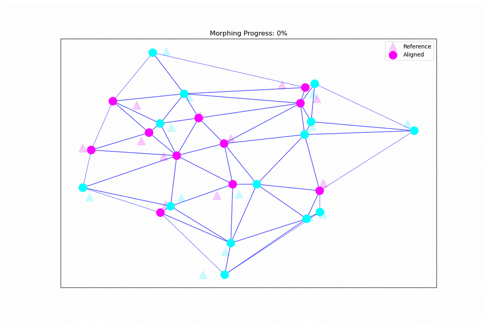

# Algorithm Overview

SAME formulates cell matching as a Mixed Integer Program (MIP) that balances cell type similarity with spatial consistency.

## Problem Formulation

Given:
- **Reference cells** $R = \{r_1, ..., r_n\}$ with coordinates and cell type probabilities
- **Aligned/moving cells** $A = \{a_1, ..., a_m\}$ to be matched to reference
- **Delaunay triangulation** $T$ on the aligned cells

Find: Binary match variables $x_{ij} \in \{0,1\}$ indicating whether aligned cell $a_i$ matches reference cell $r_j$.

## Objective Function

SAME minimizes:

$$\min \sum_{(i,j) \in P} c_{ij} x_{ij} + \alpha \sum_j p_j + \beta \sum_i s_i n_i + \gamma \sum_t w_t q_t$$

Where:
- $c_{ij}$ = cell type distance + coordinate distance between $a_i$ and $r_j$
- $p_j$ = penalty when reference cell $r_j$ is matched more than once
- $n_i$ = penalty when aligned cell $a_i$ is not matched (weighted by size $s_i$)
- $q_t$ = penalty when triangle $t$ flips orientation (weighted by $w_t$)

## Constraints

### 1. Valid Pairs (KNN)

Only allow matches between nearby cells:
- For each aligned cell, find K nearest reference cells within radius $R$
- Creates the set of valid pairs $P \subset A \times R$

### 2. One Match per Aligned Cell

Each aligned cell can match at most one reference cell:

$$\sum_{j: (i,j) \in P} x_{ij} \leq 1 \quad \forall i \in A$$

### 3. Max Matches per Reference Cell

Each reference cell can be matched at most $M$ times (typically $M=1$):

$$\sum_{i: (i,j) \in P} x_{ij} \leq M \quad \forall j \in R$$

### 4. Spatial Constraints (Triangle Orientation)

For each Delaunay triangle $(a, b, c)$ in the aligned data:

- Compute source orientation: $\text{sign}((b-a) \times (c-a))$
- If all vertices are matched to $(r_a, r_b, r_c)$:
  - Compute target orientation: $\text{sign}((r_b-r_a) \times (r_c-r_a))$
  - If orientations differ → triangle flip → add penalty $q_t$

## Space-Tearing Transforms

Unlike rigid registration, SAME allows **space-tearing**: situations where the spatial relationship between cells changes.

Space-tearing occurs when:
- A cell is missing in one section
- Cells appear in different relative positions
- Tissue has deformed non-rigidly

SAME handles this by:
1. Penalizing (not forbidding) triangle orientation flips
2. Allowing controlled violations with soft constraints
3. Using `delaunay_penalty` to tune flip tolerance

## Lazy Constraint Generation

For large problems, the number of triangle constraints is $O(n \times k^3)$ where $k$ is the KNN. This can be memory-prohibitive.

**Lazy mode** adds constraints on-demand:
1. Start with no triangle constraints
2. Find optimal solution without spatial constraints
3. Check for triangle flips in the solution
4. Add violated constraints as "lazy cuts"
5. Re-optimize with new constraints
6. Repeat until no more violations (or within tolerance)

Benefits:
- Memory: $O(n)$ instead of $O(n \times k^3)$
- Speed: Often much faster since most constraints are never needed
- Control: `lazy_allowed_flip_fraction` lets you accept some flips

## Algorithm Steps

1. **Preprocessing**
   - Filter cells to those with valid KNN pairs within radius
   - Build Delaunay triangulation on aligned cells
   - Filter triangles by edge length and angle quality

2. **Model Construction**
   - Create binary match variables $x_{ij}$
   - Add basic constraints (one-match, max-match)
   - Add spatial constraints (eager or lazy mode)
   - Set objective function

3. **Optimization**
   - Use Gurobi MIP solver
   - If lazy mode: use callback for constraint generation
   - Stop at time limit or optimality gap

4. **Post-processing**
   - Extract matches from solution
   - Verify spatial preservation
   - Report triangle violations

## Sliding Window

For very large spatial regions, SAME processes data in overlapping windows:

1. Divide region into grid of windows (size × size)
2. Add overlap between adjacent windows
3. Process each window independently
4. Merge results using Hopcroft-Karp bipartite matching
5. Resolve conflicts in overlap regions

## Metacells

For datasets with many same-type cells, metacells reduce problem size:

1. Build Delaunay triangulation on cells
2. Find triangles where all vertices have same cell type
3. Collapse these "homogeneous" triangles into metacells
4. Run SAME on metacells
5. Unpack matches to individual cells

See [Metacells](metacells.md) for details.
