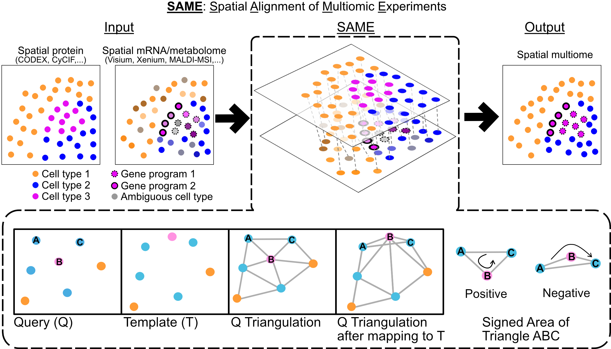

# SAME

**Spatial Alignment of Multimodal Expression**



SAME is a computational framework for aligning and integrating spatial omics data across serial tissue sections and modalities (e.g., proteins, transcripts, metabolites). SAME introduces **space-tearing transforms**, enabling controlled, localized topological disruptions during cross-sectional alignment.

## Key Features

- **Topology-flexible transforms**: Unlike rigid registration methods, SAME allows controlled space-tearing events where spatial relationships can break (e.g., when a cell is missing in one section)

- **Mixed Integer Programming**: Uses Gurobi MIP solver for optimal cell matching with spatial constraints via Delaunay triangulation. Leverages Gurobi MIP solver's lazy constraint feature to add constraints on-demand instead of upfront.

- **Metacell support**: Offers graph simplification for handling large datasets and for large space tears(~100k+ cells) efficiently

- **Lazy constraints**: Memory-efficient constraint generation instead of enumerating all O(n×k³) constraints upfront.

- **Sliding window**: Offers processing arbitrarily large spatial regions in overlapping windows with automatic merging when regions are too large to be processed in a single step.

## Quick Example

```python
from src import run_same, init_optim_params

# Basic matching
matches, var_out = run_same(
    ref_df=reference_data,
    aligned_df=moving_data,
    commonCT=['CellTypeA', 'CellTypeB', 'CellTypeC'],
    outprefix='results/'
)

print(f"Found {len(matches)} matches")
```

## When to Use SAME

SAME is designed for spatial omics integration tasks where:

1. **Serial sections**: Aligning adjacent tissue sections with potentially different cells
2. **Multi-modal data**: Integrating different spatial technologies (e.g., ISS + IMC)
3. **Missing cells**: Handling cases where cells appear/disappear between sections
4. **Tissue deformation**: Accounting for non-rigid tissue changes

## Citation

If you use SAME in your research, please cite:

> Aditya Pratapa, Siavash Mansouri, Nadezhda Nikulina, Bruno Matuck, Marc A. Schneider, Kevin Matthew Byrd, Rajkumar Savai, Purushothama Rao Tata, and Rohit Singh. "SAME: Topology-flexible transforms enable robust integration of multimodal spatial omics." bioRxiv (2025): 2025-07. https://doi.org/10.1101/2025.07.12.664419

## Contents

- [Installation](installation.md) - How to install SAME
- [Quick Start](quickstart.md) - Get started in 5 minutes
- [Algorithm Overview](concepts/algorithm.md) - How SAME works
- [API Reference](api/same.md) - Function documentation
